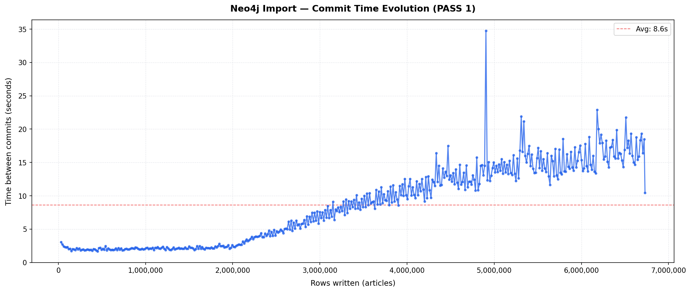
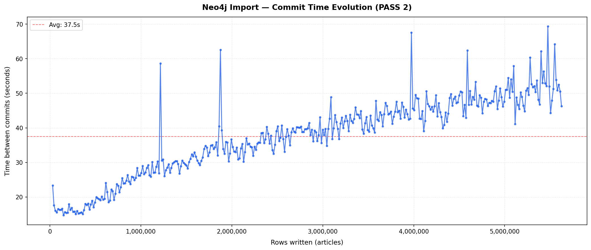

# README

#### authors: Massimo Stefani, Eva Ray

## General Information

| Information       | Description                               |
| :---------------- | ----------------------------------------- |
| Group ID          | RayStefaniAdvDaBa26                       |
| Names             | Massimo Stefani, Eva Ray                  |
| Namespace         | ray-ste-adv-daba-26                       |
| Neo4j pod id      | neo4j-2-85b4d7ff8-qh9gg, neo4j-3-65df764f45-x98sf |
| Neo4j credentials | Username: neo4j, Password: test           |
| Insert pod id     | app-2-rwxrf, app-3-4gllg                  |
| Git repository    | https://github.com/evarayHEIG/AdvDaBa_TP2 |

## Solution

The solution implements a batched, two-pass ingestion pipeline from DBLP JSONL to Neo4j.

### Data model

- If an author id is missing in the source, an id is generated by hashing the author's name and organization. This ensures that all authors have a unique identifier, even if the original data is incomplete. There cannot be collisions with the already existing author ids since they have a different format.
- `(:Author)-[:AUTHORED]->(:Article)` is created during node ingestion.
- `(:Article)-[:CITES]->(:Article)` is created only if the target article exists in the graph.

### Ingestion strategy

A two-pass approach is used to handle the interdependencies between articles and authors:

- **Pass 1:** create `Article` and `Author` nodes, then create `AUTHORED` edges.
- **Pass 2:** create `CITES` edges, if the cited article exists. 
- Each pass uses a producer-consumer pattern (2 threads): the producer parses JSONL and builds batches while the consumer commits each batch as a Neo4j transaction.

### Performance and reliability choices

* Batched writes are used to reduce transaction overhead and improve throughput.

  * The batch size is primarily set to 15,000, but additional tests were conducted during the second pass to avoid `EOF` errors. The batch size can be configured via the `BATCH_SIZE` environment variable.

* `ON CREATE` / `ON MATCH` clauses are used to minimize unnecessary updates while preserving idempotent behavior.

* A bounded `LinkedBlockingQueue` provides backpressure and limits memory growth.

* Uniqueness constraints on `_id` prevent duplicates and accelerate lookups, as an index is automatically created for any property with a uniqueness constraint.

* To avoid using `MERGE`, a local cache of existing article IDs is maintained during the first pass to check for the existence of articles and authors. This approach is potentially risky, as it can exhaust the application heap during this phase. However, monitoring shows that the heap limit is reached without causing a failure:

```
Eden:    696 MB | Old:   1672 MB | Total heap:   2668 MB | YGC: 35008.0 | FGC: 4544.0
```

After the first pass, heap usage decreases significantly because the garbage collector reclaims memory from structures that are no longer in use. During the second pass, sufficient memory is available.

* To further avoid `MERGE`, before creating `CITES` relationships, duplicate references (i.e., multiple occurrences of the same citation from one article to another) are removed. This is more efficient than using `MERGE` for each cited article, which would require a database lookup per citation.

* Runtime behavior is controlled via environment variables (`JSON_FILE`, `MAX_NODES`, `BATCH_SIZE`).

## Steps to deploy the solution

A GitHub Actions workflow is set up to automatically build an image when pushing to the repository. This image is then used in the Kubernetes deployment. 

Before deploying, the yaml configuration file of the cluster must be retrieved form the server and saved locally as `k8s/local.yaml`. This file is used to set up the `kubectl` context and access the cluster.

Then, the following commands can be used to deploy or delete the solution:

```bash
export KUBECONFIG="k8s/local.yaml"
kubectl apply -k k8s/ # deploy the solution
kubectl delete -k k8s/ # to delete the deployed resources
```

The solution consists of two main kubernetes components:
- **Neo4j database**: Running in a pod with a persistent volume claim for data storage. It is configured with environment variables for authentication.
- **Ingestion component**: Deployed as a job that runs the data ingestion process. It uses the image built from the repository and is configured with environment variables to control its behavior. 

## Results
<!-- The loading time, in seconds, it took to load N + K nodes (N articles, K authors) together with an explanation of how this time can be recovered from the logs -->

Those results are based on the first pod. The second pod was still running at the time of writing.

| Information                         | Valeur        |
| :---------------------------------- | :------------ |
| Pass1: Nodes + Authored Relationships Time | 3862,8 s  |
| Pass 1 + Relationship Reference Time | 17932,0 s |
| Nb Article Nodes                    | 6729828       |
| Nb Author Nodes                     | 5453927       |
| Total Nodes                         | 12183755      |


For the creation of all nodes:
```
2026-05-03 22:58:29.145 [mse.advDB.Example.main()] INFO mse.advDB.Example - Loading started at: 2026-05-03T22:58:29.145896908Z

... 

2026-05-04 00:02:51.889 [Thread-3] INFO mse.advDB.Example - [PASS 1 Consumer] Finished – 6729828 articles committed
```

All nodes were fully created during this initial pass, completed in approximately 1 hour, 4 minutes, and 22.744 seconds. But the entire ingestion process, including the second pass, took approximately 4 hours, 58 minutes, and 6.666 seconds.


The logs can be recovered using:

```bash
kubectl logs app-2-rwxrf -n ray-ste-adv-daba-26
```

For the pod that is still running:
```bash
kubectl logs app-3-4gllg -n ray-ste-adv-daba-26
```

### Analysis

Both passes were tested with a batch size of 15,000. During the first run, we set a maximum of 5 retries for the entire ingestion. This proved insufficient: the second pass eventually exhausted its retry budget and aborted. To address this, we increased the retry limit specifically for the second pod, but it had not completed at the time of writing.

The graphs below show the time between commits (y-axis) as a function of the number of rows written (x-axis) for each pass.

**Pass 1 — commit times**



**Pass 2 — commit times**



For the first pass, up to approximately 2 million rows, writes are fast and consistent, reflecting stable Neo4j conditions with no contention or memory pressure. Beyond that point, commit times rise in a broadly linear trend but with pronounced spikes. These spikes indicate moments of significantly higher latency, likely driven by garbage collection pauses, growing index maintenance cost, or network instability. The sharpest spikes, particularly toward the end of each pass, correspond to transaction timeouts that triggered retries.

For the second pass, seen that the DB has already been populated with all nodes, commit times are generally much higher and more variable. This is expected, as the second pass involves more complex operations (checking for existing nodes and creating relationships) that are more sensitive to database load and memory conditions. The DB must keep all nodes in memory to match cited articles, which likely contributes to increased garbage collection activity and longer commit times. The spikes in the second pass are more frequent and pronounced, reflecting the increased complexity and load on the database.